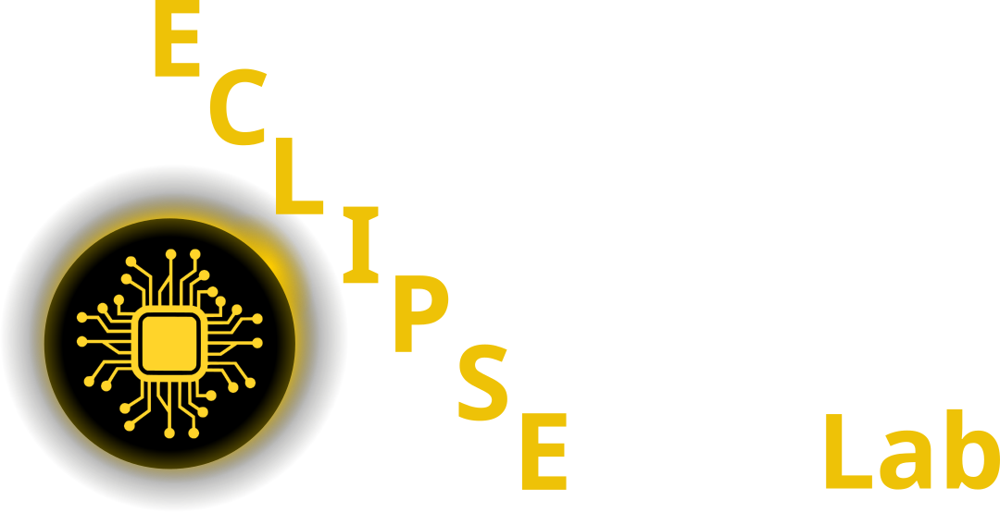
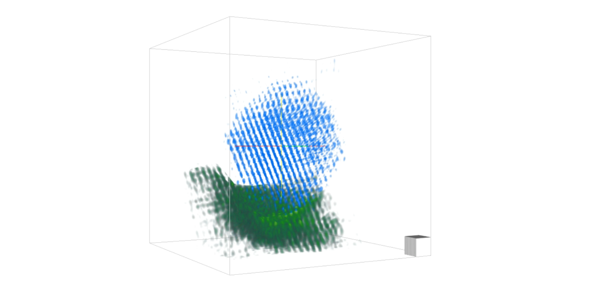
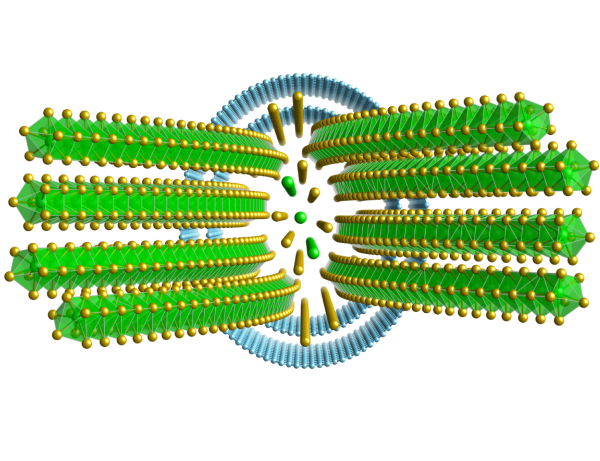
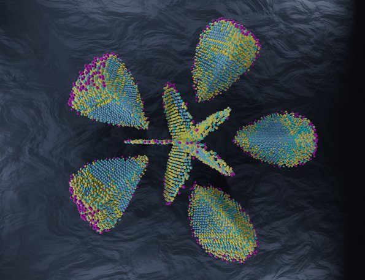
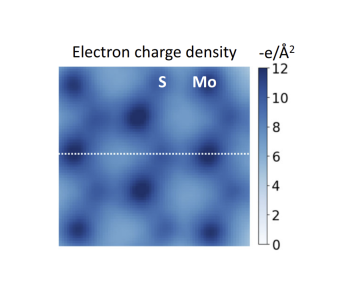

::: {.lead}
  Welcome to the
  <picture>
    <source type="image/webp" srcset="./img/optimized/eclipse_header-540.webp 540w, ./img/optimized/eclipse_header-810.webp 810w, ./img/optimized/eclipse_header-1080.webp 1080w" sizes="65vw">
    
  </picture>
:::

::: {.hero2}
  We develop computational tools to enable new capabilities in electron and X-ray microscopes and apply them to challenging materials science questions.
:::

::: {.lead}
  Publication Highlights
:::
```{=html}
<script src="https://cdn.jsdelivr.net/npm/@splidejs/splide@4.1.4/dist/js/splide.min.js"></script>
<link href="https://cdn.jsdelivr.net/npm/@splidejs/splide@4.1.4/dist/css/splide.min.css" rel="stylesheet">
<div class="splide" role="group" aria-label="Image Slider">
  <div class="splide__track">
		<ul class="splide__list">
      <li class="splide__slide">
        <div>
          <a href="https://doi.org/10.1088/1402-4896/ad9a1a">New Resolution Record in 3D Phase-Contrast Imaging
 (Phys Scripta 2024)</a>
					
				</div>
        <picture>
          <source type="image/avif" srcset="img/optimized/vol1-600.avif 600w, img/optimized/vol1-900.avif 900w, img/optimized/vol1-1200.avif 1200w" sizes="100vw">
          <source type="image/webp" srcset="img/optimized/vol1-600.webp 600w, img/optimized/vol1-900.webp 900w, img/optimized/vol1-1200.webp 1200w" sizes="100vw">
          
        </picture>
      </li>
      <li class="splide__slide">
        <div>
          <a href="https://www.nature.com/articles/s41467-023-43634-z">Solving Complex Nanostructures With Ptychographic Atomic Electron Tomography
 (Nat Comm 2023)</a>
					
				</div>
        <picture>
          <source type="image/avif" srcset="img/optimized/zr_te_structure-300.avif 300w, img/optimized/zr_te_structure-450.avif 450w, img/optimized/zr_te_structure-600.avif 600w" sizes="100vw">
          <source type="image/webp" srcset="img/optimized/zr_te_structure-300.webp 300w, img/optimized/zr_te_structure-450.webp 450w, img/optimized/zr_te_structure-600.webp 600w" sizes="100vw">
          
        </picture>
      </li>

			<li class="splide__slide">
        <div>
          <a href="https://pubs.acs.org/doi/10.1021/acsnano.1c07772">Simultaneous Successive Twinning Captured by Atomic Electron Tomography (ACS Nano 2021)</a>
				</div>
        <picture>
          <source type="image/avif" srcset="img/optimized/grey_waves1-300.avif 300w, img/optimized/grey_waves1-450.avif 450w, img/optimized/grey_waves1-595.avif 595w" sizes="100vw">
          <source type="image/webp" srcset="img/optimized/grey_waves1-300.webp 300w, img/optimized/grey_waves1-450.webp 450w, img/optimized/grey_waves1-595.webp 595w" sizes="100vw">
          
        </picture>
      </li>
      <li class="splide__slide">
        <div>
          <a href="https://www.nature.com/articles/s41467-023-39304-9">Imaging the electron charge density in monolayer MoS2 at the Angstrom scale (Nat Comm 2023)</a>
				</div>
        
      </li>

		</ul>
  </div>
  <div class="splide__progress">
		<div class="splide__progress__bar">
		</div>
  </div>
</div>

<script>

  document.addEventListener( 'DOMContentLoaded', function () {
    new Splide( '.splide', {
  type   : 'loop',  
  interval: 5000,
  speed: 1000,
  autoplay: true,
  height: 600,
  heightRatio: 0.5,
}).mount();
  } );
 
</script>
```


::: {.lead}
  We are an [interdisciplinary]{.fw-bolder} research group based within the [Department of Materials Science](https://www.ww.tf.fau.de/){.text-primary .text-decoration-none .fw-semibold} at the [Friedrich-Alexander University of Erlangen-Nürnberg](https://www.fau.de/){.text-primary .text-decoration-none .fw-semibold}. We have expertise in [condensed matter physics, deep learning, large-scale optimization, signal and image processing, and experimental design]{.fw-bolder} for advanced [X-ray and electron microscopy]{.fw-bolder} experiments. 

We are part of the [Institute of Micro- and Nanostructure Research](https://www.em.tf.fau.de/) and the [Center for Nanoanalysis and Electron Microscopy](https://www.cenem.fau.de/) and part of the Competence Unit [Engineering of Advanced Materials](https://www.eam.fau.eu/).
:::
::: {.lead}
  How can we help you today?
:::

:::: {.columns}

::: {.column width="33%"}
#### Prospective students & researchers

Learn about open positions, projects, and how to join the lab.

- MSc and PhD theses
- Postdoctoral positions
- Short-term research projects

[See open opportunities](opportunities.qmd){.btn .btn-primary title="Open positions, projects, and how to join the lab"}
:::

::: {.column width="33%"}
#### Collaborators & facilities

See our research directions and how we work with partners.

- Advanced electron and X-ray microscopy
- Method development and software
- Access to instrumentation and expertise

[See research themes](research.qmd){.btn .btn-primary .me-1 title="Overview of our research directions and capabilities"}
[Browse resources](resources.qmd){.btn .btn-outline-secondary title="Software, datasets, and practical information for collaborators"}
:::

::: {.column width="34%"}
#### What’s new?

Talks, awards, and other recent lab news.

- Recent talks and workshops
- Grants, awards, and recognitions
- New people and projects

[Read lab news](news.qmd){.btn .btn-primary title="Recent talks, awards, people, and other lab news"}
:::

::::